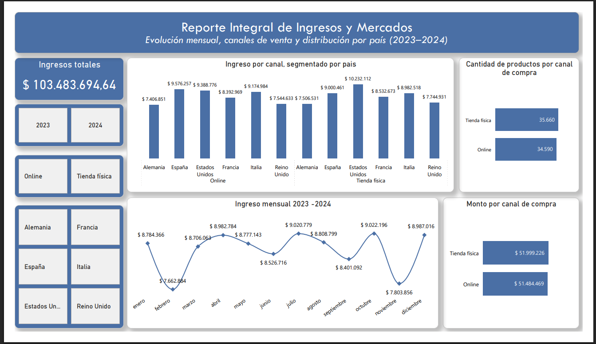
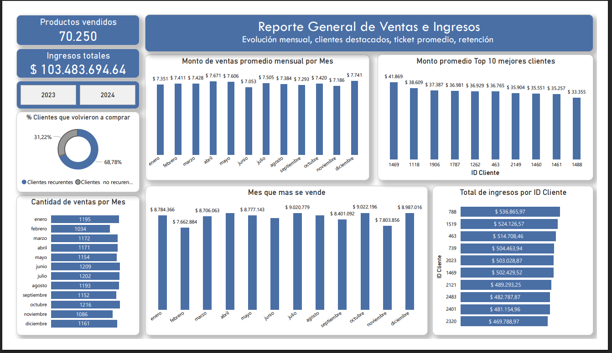
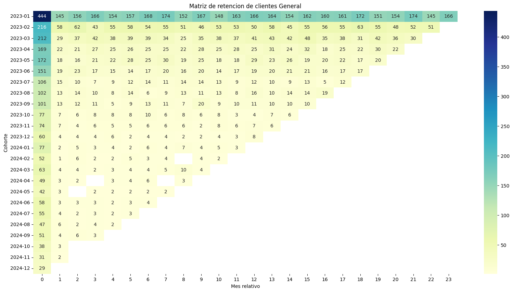
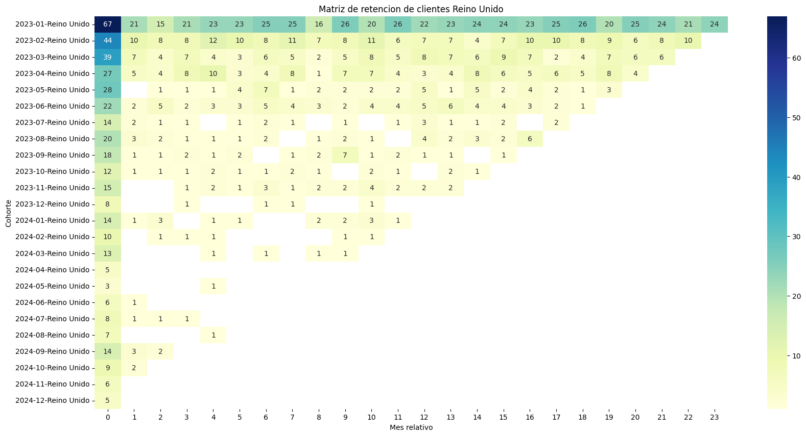
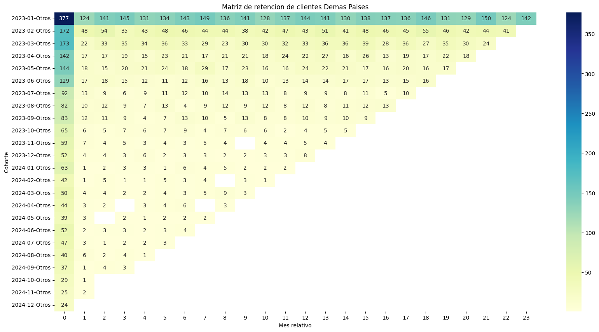

# Análisis de Ventas E-commerce 2025

##  Flujo de trabajo
- Extracción → Limpieza → Análisis → Segmentación → Visualización

##  Objetivo
Evaluar la salud del negocio e-commerce mediante análisis de ventas, retención de clientes y segmentación RFM. El análisis permite detectar patrones de compra, identificar clientes valiosos y zonas de mejora en la retención.

##  Fuente de los datos
- Dataset propio de ventas e-commerce (15.000 registros)
- Columnas principales: ID Cliente, Fecha compra, Monto, País, Canal, Región

##  Herramientas utilizadas
- Python: limpieza, creación de métricas, cálculo de retención (cohortes)
- Excel: KPIs, segmentación RFM
- Excel y Power BI: dashboards interactivos

##  Gráficos destacados

## Informe completo
Podés ver el informe completo del proyecto en formato PDF:  
[Informe de Ventas E-commerce](./reports/Informe_análisis_de_ventas_ecommerce.pdf)

**Autor:**  
**Matías Costa**  
Data Analyst | Estudiante de Licenciatura en Informática
